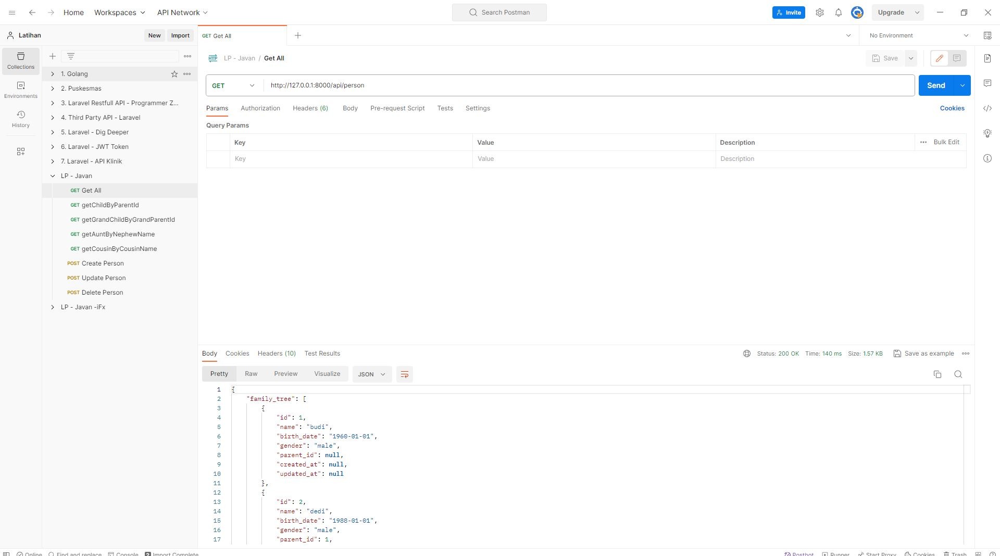

# Installation Steps:

1. **Clone Repository**

    ```bash
    git clone https://github.com/fauzanlnh/Web-SI-Cafe.git
    cd Web-SI-Cafe / folder-name
    ```

2. **Install Dependencies**

    ```bash
    composer install
    ```

    or

    ```bash
    composer update
    ```

3. **Setup or Create File .env**

    ```bash
    cp .env.example .env
    ```

4. **Generate APP_KEY in file .env**

    ```bash
    php artisan key:generate
    ```

5. **Create Database**

    Set up a database for the application.

6. **Migrate & Seed Database**

    ```bash
    php artisan migrate --seed
    ```

7. **Run Local Server**
    ```bash
    php artisan serve
    ```
    Access the web application at http://localhost:8000.

These instructions provide a step-by-step guide to set up the System Information Cafe application on a local environment. Make sure to follow each step carefully to ensure a successful installation.

# API Using

1. **Import Postman Collection in folder 'tests' to postman desktop**
2. **Run Local Server**
    ```bash
     php artisan serve
    ```
3. **Use the Request template for test the API**

   
